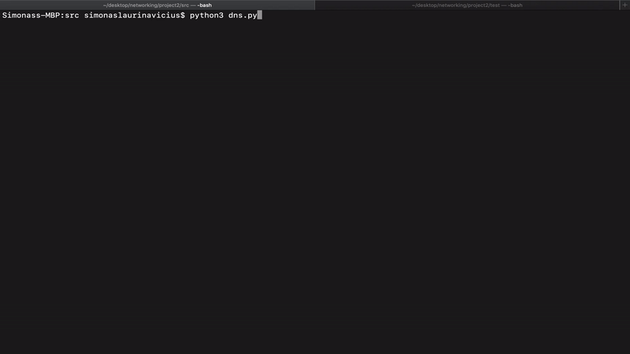

# Mock DNS Server implemented in Python
Server functionality is limited to SOA, NS, MX, A, * type records.  
Server does not support recursion, message compression, also authority and additional record sections of a response are always empty.  
For the sake of easier parsing, I used JSON to format zone files for the domain.

Made as a study project for my Computer Networking class at Vilnius University.  
Goal of the project was to try to implement some kind of an Application Layer Protocol on your own and get experience reading technical documentation.

Chose DNS as I was interested in how it works "under the hood", lots of fun!



## Table of contents
* [Requirements](#requirements)
* [Setup](#setup)
* [Run](#run)
* [Testing](#testing)
* [License](#license)
* [References](#references)

## Requirements
Project requires:
* Python version: 3.7 or newer
 
## Setup
To install Python go to [Python Downloads](https://www.python.org/downloads/)  
To install Dig go to [Install Dig](https://www.digitalocean.com/docs/networking/dns/resources/use-dig/)

## Run
Navigate to **src** folder locally and run:
```sh
python3 dns.py
```

## Testing
Assuming you have server up and running, navigate to **tests** folder locally and run:
#### For Type A Records
```sh
dig @localhost -f a_records.txt
```
#### For Type MX Records
```sh
dig @localhost -f mx_records.txt
```
#### For Type ANY Records
```sh
dig @localhost -f any_records.txt
```
#### For Type SOA Records
```sh
dig @localhost -f soa_records.txt
```
#### For Type NS Records
```sh
dig @localhost -f ns_records.txt
```
#### For NXDOMAIN Status
```sh
dig @localhost -f nxdomain.txt
```

## License

This project is licensed under the MIT License - see the [LICENSE](LICENSE) file for details

## References
* [RFC 1034](https://tools.ietf.org/html/rfc1034)
* [RFC 1035](https://tools.ietf.org/html/rfc1035)
* [Wireshark](https://www.wireshark.org)
